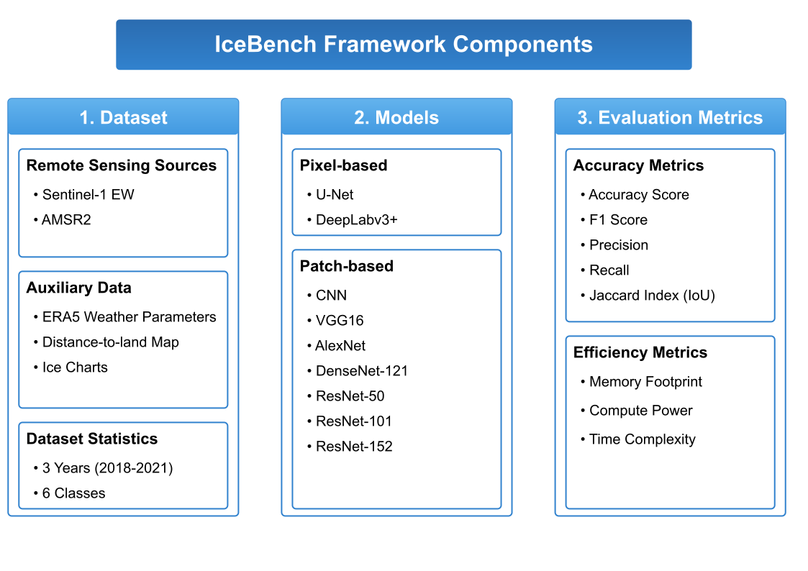

# IceBench: A Benchmark for Deep Learning based Sea Ice Type Classification

This repository contains the code implementation for the paper "IceBench: A Benchmark for Deep Learning based Sea Ice Type Classification". Our framework provides a comprehensive approach to analyzing and classifying sea ice types using various deep learning techniques. This benchmark is designed to accurately track progress in sea ice type classification at the pixel or patch level. Despite the many studies on this subject, it’s often still not clear which methods truly work well.

[](https://arxiv.org/abs/XXXX) [](#) [](https://github.com/samiraat/Awesome-Sea-Ice-Papers) [](https://github.com/bdlab-ucd/sea-ice-leaderboard)
 [](https://github.com/bdlab-ucd/IceBench/tree/main)




Paper: 

- [Getting Started](#getting-started)
- [Repo Structure](#Repo-structure)
- [Usage](#usage)
- [Experiments](#experiments)
- [Data Description](#data-description)
- [Comparing Your Model](#comparing-your-model)
- [Submitting Your Model to the Leaderboard](#submitting-your-model-to-the-leaderboard)
- [Contributing](#contributing)
- [Citation](#citation)
- [License](#license)
- [Acknowledgments](#acknowledgments)


## Getting Started

### Prerequisites

- dependencies listed in sea_ice_benchmark.yaml

### Installation

1. Clone the repository:
   ```bash
   git clone https://github.com/bdlab-ucd/IceBench
   cd IceBench
3. Install the required packages:
   Set up the environment using Anaconda:
   ```bash
   conda env create -f sea_ice_benchmark.yaml
   conda activate sea_ice_benchmark

## Repo structure 

The project is organized into several key directories, each serving a specific purpose:


| Directory                       | Description                                                                                                   |
|---------------------------------|---------------------------------------------------------------------------------------------------------------|
| `configs/`                      | Contains configuration files for both models and datasets |
| `src/`                          | The source code directory, further divided into several subdirectories:                                        |
| `src/classification/`           | Implements models, data handling, training, and evaluation scripts for patch-based sea ice type classification. |
| `src/segmentation/`             | Implements models, data handling, training, and evaluation scripts for pixel-based sea ice type classification.   |
| `src/data_preprocessing/`       | Includes scripts for preparing the datasets, such as downscaling, generating labels, etc.         |
| `case_studies/`                  | Contains scripts for case studies, further organized into:                   |
| `experiments/classification/`   | Scripts specifically for patch-based experiments.                                                           |
| `experiments/segmentation/`     | Scripts specifically for pixel-based experiments.                                                             |


### Usage

1. Configure your experiment parameters in the relevant configuration files under `configs/`.


## Case Studies

Our framework includes a suite of experiments designed to assess various factors affecting the performance of patch-based and pixel-based sea ice classofocation models. Each script in our repository serves a distinct purpose, detailed in the table below:

| File Name                                  | Description                                                                                                                                                                                |
|--------------------------------------------|--------------------------------------------------------------------------------------------------------------------------------------------------------------------------------------------|
| `model_parameter_sensitivity_analysis.py`  | Conducts sensitivity analysis to explore how different model parameters affect the model’s performance.                                                                                   |
| `impact_cryospheric_season.py`             | Trains and tests the model based on the cryospheric season (freeze or melt) across various locations to evaluate seasonal impact on performance.                                           |
| `impact_cryospheric_season_each_location.py` | Allows training of the model by specific cryospheric seasons (melt/freeze) and specific locations. Configuration for locations and seasons needs to be set in data files.                  |
| `impact_regular_season.py`                 | Investigates the impact of training the model on data from specific conventional seasons (spring, summer, fall, winter), which are to be identified in the configuration files.             |
| `impact_each_regular_season_each_location.py` | Trains the model for specific conventional seasons (spring, summer, fall, winter) and locations, which need to be defined in the configuration files.                                     |
| `impact_downscale_ratio.py`                | Focuses on training the model with data at various downscaling ratios to determine the impact of data resolution on performance.                                                            |
| `impact_patchsize.py`                      | Evaluates the influence of using different patch sizes on model performance; patch sizes must be specified in the configuration file.                                                      |
| `impact_datasize.py`                       | Enables training the model on datasets of different sizes to study the effect of data quantity on model effectiveness.                                                                    |
| `impact_data_prep.py`                      | Analyzes the impact of different data preparation methods, including augmentation, distance to border, and the inclusion/exclusion of land pixels.                                         |
| `feature_importance.py`                    | Utilizes the Captum library to assess feature importance using methods such as Integrated Gradients, Feature Ablation, Gradient SHAP, and DeepLIFT SHAP, generating scores for each feature.   |


Each experiment is crafted to provide insights into how various adjustments and configurations can influence the efficacy and accuracy of our models. Refer to the specific scripts in the `experiments/` directory for detailed implementation and usage instructions.


## Data Description

This project utilizes two main datasets:

1. **AI4Arctic Sea Ice Challenge Dataset**: 
   We use the raw version of this dataset, which was produced for the AutoICE competition initiated by the European Space Agency (ESA) ɸ-lab. The purpose of the competition is to develop deep learning models to automatically produce sea ice charts including sea ice concentration, stage-of-development and floe size (form) information.

   You can access this dataset at:
   [https://data.dtu.dk/collections/AI4Arctic_Sea_Ice_Challenge_Dataset/6244065](https://data.dtu.dk/collections/AI4Arctic_Sea_Ice_Challenge_Dataset/6244065)

   Alternatively, you can use the ready-to-train data provided in the same collection.

   Citation:
   Buus-Hinkler, Jørgen; Wulf, Tore; Stokholm, Andreas Rønne; Korosov, Anton; Saldo, Roberto; Pedersen, Leif Toudal; et al. (2022). AI4Arctic Sea Ice Challenge Dataset. Technical University of Denmark. Collection. https://doi.org/10.11583/DTU.c.6244065.v2

2. **NASA Earth Observatory's Arctic Sea Ice Melt dataset**:
   We use this dataset to determine the cryospheric season (melt or freeze) for each file in our primary dataset. You can access this dataset at:
   [https://earth.gsfc.nasa.gov/cryo/data/arctic-sea-ice-melt](https://earth.gsfc.nasa.gov/cryo/data/arctic-sea-ice-melt)

   Data Description: Yearly maps of early melt, melt, early freeze, and freeze conditions for the surface of sea ice derived from SSM/I data.

   Reference: Markus, T., J. C. Stroeve, and J. Miller (2009), Recent changes in Arctic sea ice melt onset, freezeup, and melt season length, J. Geophys. Res., 114, C12024, doi:10.1029/2009JC005436

### Data Acquisition

For the AI4Arctic Sea Ice Challenge Dataset:

1. Download the raw data using the following script:

   ```bash
   # Create a directory for the data
   mkdir -p data/AI4Arctic

   # Download the train dataset
   wget -O data/AI4Arctic/train_data.zip https://data.dtu.dk/ndownloader/articles/21284967/versions/3

   # Download the test dataset
   wget -O data/AI4Arctic/test_data.zip https://data.dtu.dk/ndownloader/articles/21762848/versions/2

   # Unzip the downloaded datasets
   unzip data/AI4Arctic/train_data.zip -d data/AI4Arctic/train/
   unzip data/AI4Arctic/test_data.zip -d data/AI4Arctic/test/

   # Remove the zip files to save space
   rm data/AI4Arctic/train_data.zip
   rm data/AI4Arctic/test_data.zip
   
2. Alternatively, if you prefer to skip the preprocessing step and use ready-to-train data, replace the download links in the script above with the following:
   ```bash
   # Download the ready-to-train train dataset
   wget -O data/AI4Arctic/train_data.zip https://data.dtu.dk/ndownloader/articles/21316608/versions/3

   # Download the ready-to-train test dataset
   wget -O data/AI4Arctic/test_data.zip https://data.dtu.dk/ndownloader/articles/21762830/versions/2

For the NASA Earth Observatory dataset:
1. Download the dataset from the provided link.
2. Use our scripts to categorize the primary dataset files into melt or freeze seasons based on this information.
3. The categorized file lists are stored as JSON files in the `files_json/` directory, following the naming convention: `{season}_{location}_train_files.json`.

Ensure you have adequate storage and processing capacity, as these datasets can be quite large.

## Comparing Your Model


To compare your own models with our baselines or train custom models on dataset, check out the [model_comparison](./model_comparison/) directory.

## Submitting Your Model to the Leaderboard

We welcome external contributions to our leaderboard! To submit your model, follow these steps:

### Prepare your model for submission

Make sure your model is compatible with the evaluation script and performs predictions on the test dataset in the same format as required by the AI4Arctic Sea Ice Challenge dataset. 

### Leaderboard Submission

Once your pull request is reviewed, we will evaluate your model on the test set and add your results to the leaderboard. You can view the leaderboard and more details about the submission process [here](https://github.com/bdlab-ucd/sea-ice-leaderboard).

For any questions or assistance during submission, feel free to open an issue, and we’ll be happy to help!


## Contributing

We welcome contributions to improve the benchmark framework. Please feel free to submit issues or pull requests.

## Citation

If you use this code in your research, please cite our paper:
@article{IceBench,
title={IceBench: A Benchmark for Deep Learning based Sea Ice Type Classification},
author={Samira Alkaee Taleghan, Andrew P. Barrett, Walter N. Meier, Morteza Karimzadeh, Farnoush Banaei-Kashani},
journal={Journal Name},
year={2025}
}


## License


## Acknowledgments


